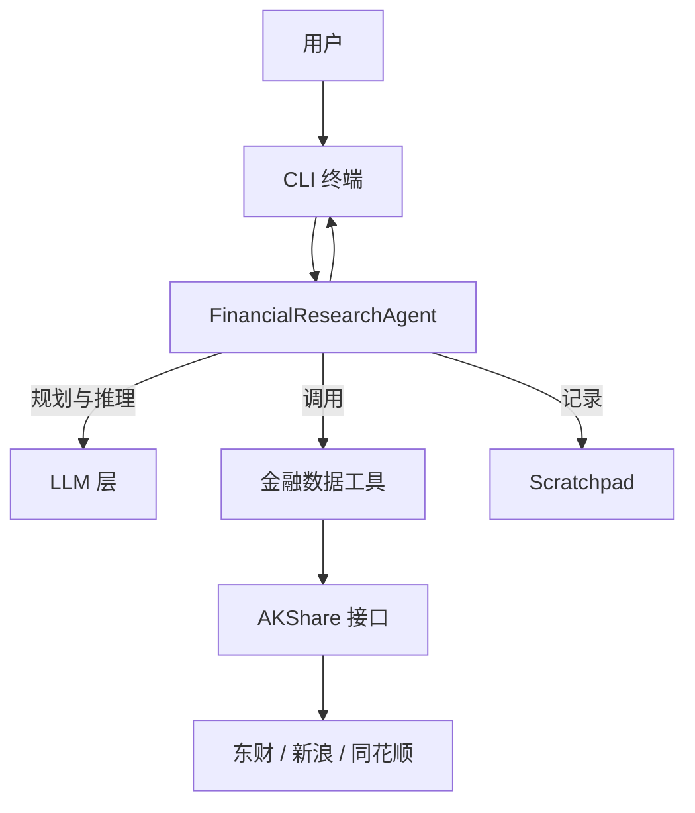

<div align="center">


[](https://www.python.org/downloads/)
[](LICENSE)
[](https://github.com/akfamily/akshare)

**OpenFR:轻量级的金融研究 Agent | 基于 AKShare | 支持多种 LLM | 自动数据获取与分析**

**现支持双模式运行：Python CLI (原版) 或 TypeScript Agent (基于 pi-mono 混合架构)**

[English](README_EN.md) | [快速开始](#快速开始) • [功能特性](#功能特性) • [使用指南](#使用指南) • [配置说明](#配置说明) • [架构设计](#架构设计)

</div>

下面是一次完整请求「贵州茅台适合买入吗？」在终端中的实际展示示例（三张截图对应同一次请求的不同阶段）：

<table>
  <tr>
    <td align="center">
      <br/>
      <sub>图 1：LLM 规划研究步骤（Plan-Execute 规划阶段）</sub>
    </td>
    <td align="center">
      <br/>
      <sub>图 2：按步骤调用金融数据工具并展示中间结果</sub>
    </td>
    <td align="center">
      <br/>
      <sub>图 3：综合所有步骤给出最终结论和投资建议</sub>
    </td>
  </tr>
</table>

---

## 📊 项目简介

OpenFR (Open Financial Research) 是一个**极简、轻量**的智能金融研究 Agent，基于大语言模型并集成 AKShare 数据接口，提供股票、基金、期货、指数、宏观经济等金融数据的自动化查询和分析能力。

<a id="功能特性"></a>
### ✨ 核心特性

- 🌱 **极简 & 轻量** - 纯 Python 包 + Typer CLI，仅依赖AKShare数据，一条命令即可开始研究
- 🤖 **规划驱动的 Agent** - Plan-Execute：先拆解任务，再按步骤调用工具并综合回答
- ⚡ **高性能优化** - 只读工具并行调用、多数据源重试与智能降级、结果截断与上下文压缩
- 🎯 **智能工具选择** - 根据问题类型选择最相关的行情 / 板块 / 宏观工具
- 📈 **丰富的数据源** - 35+ 金融数据工具，覆盖 A 股、港股、基金、期货、指数、宏观及行业板块
- 🔄 **多 LLM 支持** - 支持 15+ 主流 LLM 提供商（国产 + 海外 + 本地）
- 🎨 **美观的 CLI** - Rich 终端界面，实时显示规划、工具调用与最终分析结果
- 🔌 **智能备用切换** - 东方财富 + 新浪 + 同花顺，多数据源自动切换与重试
- 💾 **缓存与限流友好** - 股票列表缓存 6 小时，部分行情接口缓存 1 分钟，减少重复请求
- 📝 **对话记忆与 Scratchpad** - 维护最近对话与工具调用历史，支持多轮追问
- 🛡️ **错误恢复** - 失败重试、降级替代及“基于已有信息收尾”的保护逻辑

---

<a id="架构设计"></a>
## 🏗️ 架构设计

OpenFR 支持两种运行模式：

### 模式一：Python 原版 CLI（原有方式）



### 模式二：TypeScript + Python 混合架构（新增）

基于 [pi-mono](https://github.com/nichochar/pi-mono) 框架（`pi-ai` + `pi-agent-core`），TypeScript 负责 Agent 编排，Python 通过 HTTP API 暴露金融数据工具。

```
┌─────────────────────────────────┐     HTTP      ┌──────────────────────┐
│  TypeScript Agent (pi-mono)     │ ◄──────────► │  Python Tool Server  │
│  - pi-ai (LLM streaming)       │   JSON API    │  - FastAPI           │
│  - pi-agent-core (agent loop)  │               │  - 35+ AKShare tools │
│  - Plan-Execute orchestration  │               │  - 并行执行支持        │
│  - CLI (chalk + ora)           │               │  - 工具发现 + 调用     │
└─────────────────────────────────┘               └──────────────────────┘
```

**TypeScript Agent 优势：**
- 利用 pi-mono 的统一 LLM API，原生支持 streaming、工具调用
- Agent 编排逻辑与数据工具解耦，便于独立迭代
- TypeScript 生态丰富，便于集成 Web UI 或 API 服务

### 架构特点

**统一的 Plan-Execute 流程**
- 接到问题后先用 LLM 规划 2～5 个研究步骤，再按步骤逐个执行工具调用
- 每步结束后把关键信息写入 Scratchpad，最终基于所有步骤结果进行综合回答

**性能优化**
- **缓存**：股票代码列表等长周期数据缓存 6 小时，部分行情数据做短期缓存
- **并行工具调用**：对行情/指数/宏观等只读工具支持并行执行，可配置 `OPENFR_ENABLE_PARALLEL_TOOLS`
- **多数据源降级**：指数、行业板块、A 股行情等都集成了东财/新浪/同花顺等多源与自动重试
- **上下文压缩**：对过长的工具结果做截断，只把关键信息反馈给 LLM

**数据层**
- **多数据源**：东方财富（主）+ 新浪财经（备）
- **智能重试**：网络错误自动重试，指数退避
- **降级策略**：主接口失败自动切换备用源

---

<a id="快速开始"></a>
## 🚀 快速开始

### 安装（Python 原版）

```bash
# 克隆仓库
git clone https://github.com/openmozi/openfr.git
cd openfr

# 创建虚拟环境
python -m venv .venv
source .venv/bin/activate  # Windows: .venv\Scripts\activate

# 安装依赖
pip install -e .
```

### 安装（TypeScript 混合模式）

在完成上面的 Python 安装后，额外执行：

```bash
cd ts
npm install
cd ..
```

### 配置

创建 `.env` 文件并配置 API 密钥：

```bash
# 默认推荐：智谱 AI（默认提供商已改为 zhipu）
ZHIPU_API_KEY=your_zhipu_api_key_here
OPENFR_PROVIDER=zhipu
# 默认模型：glm-4.7（也可省略 OPENFR_MODEL，程序会使用提供商默认模型）
OPENFR_MODEL=glm-4.7
```

更多环境变量与高级配置，请参考下方的 **[配置说明](#配置说明)** 章节。

### 开始使用

```bash
# 启动聊天
openfr chat

# 然后输入你的问题
你: 贵州茅台今天股价多少?
你: 搜索宁德时代
你: 上证指数走势如何?
```

### 基本使用

#### Python CLI（原版）

##### 1. 启动聊天

```bash
# 进入交互模式（推荐）
openfr chat

# 或指定提供商和模型
openfr chat -p zhipu -m glm-4.7
openfr chat -p anthropic
```

##### 2. 使用示例

启动后，直接输入你的问题：

```
你: 贵州茅台今天股价多少?
你: 搜索宁德时代
你: 分析今天的热门板块
你: 上证指数走势如何?
```

**验证整体执行流程（推荐）**：可用以下单次查询测试「先规划任务再按步执行」的完整流程（需已配置 API Key）：

```bash
openfr query "贵州茅台适合买入吗"
```

将依次看到：任务规划（若干步骤）→ 第 1/N 步 … 第 N/N 步（每步调用工具）→ 最终综合回答。若某步数据源暂时不可用，会给出提示并基于已有信息收尾。

##### 3. 查看可用工具和技能

```bash
# 列出所有金融数据工具
openfr tools

# 查看支持的提供商
openfr providers
```

#### TypeScript Agent（混合模式）

TS Agent 自动管理 Python Tool Server 的生命周期（自动启动/关闭）。

```bash
cd ts

# 单次查询
npx tsx src/index.ts query "贵州茅台适合买入吗？"

# 交互式聊天
npx tsx src/index.ts chat

# 列出可用工具
npx tsx src/index.ts tools
```

也可以手动启动 Python Tool Server：

```bash
# 启动 Python Tool Server（默认端口 18321）
openfr-server

# 或自定义端口
OPENFR_SERVER_PORT=8080 openfr-server

# 健康检查
curl http://127.0.0.1:18321/health

# 查看所有工具
curl http://127.0.0.1:18321/tools

# 调用工具
curl -X POST http://127.0.0.1:18321/tools/search_stock \
  -H 'Content-Type: application/json' \
  -d '{"args": {"keyword": "茅台"}}'
```

---

<a id="使用指南"></a>
## 📖 使用指南

### 支持的查询类型

启动 `openfr chat` 后，可以进行以下查询：

#### 📈 A股查询

```
# 实时行情
查询 000001 的实时行情
平安银行今天股价

# 历史数据
贵州茅台最近一周的走势
查询 600519 从 20240101 到 20240131 的历史数据

# 股票搜索
搜索茅台
查找新能源相关股票

# 股票新闻
平安银行最新新闻

# 热门股票
今天的热门股票有哪些?
```

#### 🇭🇰 港股查询

```
# 实时行情
查询港股 00700 的实时行情
腾讯控股今天股价
阿里巴巴 09988 最新数据

# 历史数据
港股 00700 最近一个月的走势
查询 09988 历史数据

# 港股搜索
搜索港股腾讯
搜索港股理想汽车
```

#### 🇺🇸 美股查询（暂不支持）

当前版本暂不提供美股行情与历史数据查询，后续如接入更稳定的数据源会在文档中更新说明。

#### 💼 基金查询

```
# ETF 行情
查询 510300 的 ETF 数据
沪深300 ETF 今天表现如何?

# 基金排行
股票型基金排行榜
按近1年业绩排序的基金
```

#### 📊 指数和板块

```
# 指数行情
上证指数今天走势
创业板指数最新数据

# 行业板块
今天涨幅最大的行业板块
科技板块表现如何?
```

#### 🌍 宏观经济

```
# 经济指标
最新的 CPI 数据
近期 GDP 增长情况
PMI 指数走势
```

---

<a id="配置说明"></a>
## ⚙️ 配置说明

### 环境变量

创建 `.env` 文件（只列出主要项，完整列表可参考 `openfr.config.Config.from_env` 注释）：

```bash
# ============= 常用配置（推荐） =============
OPENFR_PROVIDER=zhipu
OPENFR_MODEL=glm-4.7
ZHIPU_API_KEY=your_zhipu_api_key_here

# ============= 通用 LLM 配置 =============
OPENFR_TEMPERATURE=0.0
OPENFR_MAX_TOKENS=4096
OPENFR_MAX_ITERATIONS=10
OPENFR_VERBOSE=true

# ============= 性能相关配置 =============
OPENFR_ENABLE_PARALLEL_TOOLS=true        # 是否允许同一轮中多个工具并行执行
OPENFR_ENABLE_PARALLEL_SOURCES=true      # 是否允许工具内部多数据源并行尝试（部分高危源会强制串行）

# ============= 工具开关（默认全开） =============
OPENFR_ENABLE_STOCK_TOOLS=true
OPENFR_ENABLE_STOCK_HK_TOOLS=true
OPENFR_ENABLE_FUND_TOOLS=true
OPENFR_ENABLE_FUTURES_TOOLS=true
OPENFR_ENABLE_MACRO_TOOLS=true
OPENFR_ENABLE_INDEX_TOOLS=true

# ============= Agent 行为 =============
OPENFR_ENABLE_PLAN_EXECUTE=true          # 目前主要走规划+执行流程
OPENFR_ENABLE_SELF_VALIDATION=true       # 给出最终回答前做一次”自检与补充”
OPENFR_ENABLE_LOOP_DETECTION=true        # 连续多次失败/无效工具调用时强制收尾
OPENFR_MAX_TOTAL_TOOL_CALLS=14           # 单次会话最大工具调用次数

# ============= TypeScript Agent 专用 =============
OPENFR_TOOL_SERVER_URL=http://127.0.0.1:18321  # Python Tool Server 地址
OPENFR_SERVER_HOST=127.0.0.1                    # Tool Server 监听地址
OPENFR_SERVER_PORT=18321                        # Tool Server 监听端口
```

### 模型提供商列表（完整）与配置项

说明：
- **provider**：传给 `openfr chat/query -p <provider>` 或 `.env` 的 `OPENFR_PROVIDER`
- **API Key 环境变量**：按下表设置
- **默认模型**：不设置 `OPENFR_MODEL` 时使用；如需指定其它模型，设置 `OPENFR_MODEL=<model>`

| provider | API Key 环境变量 | 默认模型 | 备注                                               |
|---|---|---|--------------------------------------------------|
| deepseek | `DEEPSEEK_API_KEY` | `deepseek-chat` | OpenAI 兼容                                        |
| doubao | `DOUBAO_API_KEY` | `doubao-1-5-pro-256k` | OpenAI 兼容                                        |
| dashscope | `DASHSCOPE_API_KEY` | `qwen-max` | OpenAI 兼容                                        |
| zhipu | `ZHIPU_API_KEY` | `glm-4.7` | OpenAI 兼容（默认）                                    |
| modelscope | `MODELSCOPE_API_KEY` | `qwen2.5-72b-instruct` | OpenAI 兼容                                        |
| kimi | `KIMI_API_KEY` | `moonshot-v1-128k` | OpenAI 兼容                                        |
| stepfun | `STEPFUN_API_KEY` | `step-2-16k` | OpenAI 兼容                                        |
| minimax | `MINIMAX_API_KEY` | `MiniMax-Text-01` | OpenAI 兼容                                        |
| openai | `OPENAI_API_KEY` | `gpt-4o` | 官方 OpenAI                                        |
| anthropic | `ANTHROPIC_API_KEY` | `claude-sonnet-4-20250514` | 使用专用 SDK                                         |
| openrouter | `OPENROUTER_API_KEY` | `stepfun/step-3.5-flash:free` | 限时免费模型                                           |
| together | `TOGETHER_API_KEY` | `meta-llama/Llama-3.3-70B-Instruct-Turbo` | OpenAI 兼容                                        |
| groq | `GROQ_API_KEY` | `llama-3.3-70b-versatile` | OpenAI 兼容                                        |
| ollama | `OLLAMA_BASE_URL` | `qwen2.5:14b` | 本地；`OLLAMA_BASE_URL` 默认 `http://localhost:11434` |
| custom | `CUSTOM_API_KEY` + `CUSTOM_BASE_URL` | (空) | 自定义 OpenAI 兼容接口                                  |

---

## 🛠️ 开发指南

### 项目结构

```
openfr/
├── src/openfr/                    # Python 金融工具 & Agent
│   ├── __init__.py
│   ├── agent.py                   # Agent 核心（规划 + 执行）
│   ├── chat_history.py            # 多轮对话封装
│   ├── cli.py                     # CLI 入口（Python 原版）
│   ├── config.py                  # 配置管理
│   ├── prompts.py                 # 提示词管理
│   ├── formatter.py               # UI 格式化
│   ├── scratchpad.py              # 状态管理
│   ├── server.py                  # [新] FastAPI 工具服务器
│   └── tools/                     # 工具模块（35+ 金融数据工具）
│       ├── registry.py            # 工具注册
│       ├── parallel.py            # 并行执行
│       ├── stock.py               # A股工具
│       ├── stock_ext.py           # A股扩展工具
│       ├── stock_hk.py            # 港股工具
│       ├── fund.py                # 基金工具
│       ├── futures.py             # 期货工具
│       ├── index.py               # 指数工具
│       ├── macro.py               # 宏观工具
│       └── ...                    # 其他工具支持
├── ts/                            # [新] TypeScript Agent (pi-mono)
│   ├── package.json
│   ├── tsconfig.json
│   └── src/
│       ├── index.ts               # 入口：启动 Python server + Agent
│       ├── config.ts              # 环境变量配置、Provider 映射
│       ├── tool-discovery.ts      # 从 Python server 发现工具
│       ├── tool-proxy.ts          # AgentTool 代理（HTTP → Python）
│       ├── prompts.ts             # 金融研究提示词（从 Python 移植）
│       ├── plan-execute.ts        # Plan-Execute 编排层
│       ├── scratchpad.ts          # 工具调用追踪、循环检测
│       └── cli.ts                 # 终端交互 UI
├── tests/                         # 测试文件
├── docs/                          # 文档
├── pyproject.toml                 # Python 项目配置
├── README.md                      # 本文件
└── .env.example                   # 环境变量示例
```

## 🐛 故障排查

### 常见问题

#### 1. API Key 未配置

**错误：** `警告: 未设置 ZHIPU_API_KEY 环境变量`

**解决：**
```bash
# 在 .env 文件中添加
ZHIPU_API_KEY=your-api-key-here

# 或临时设置
export ZHIPU_API_KEY=your-api-key-here
```

#### 2. 网络连接错误

**错误：** `Connection aborted`, `Remote end closed connection`

**解决：**
- 系统会自动重试（最多 3 次）
- 等待几秒后会自动切换备用数据源
- 如果持续失败，检查网络连接或稍后重试

#### 3. 数据接口不可用

**错误：** `❌ 无法获取指数实时行情数据`

**原因：**
- 非交易时间（工作日 9:30-15:00）
- 数据源临时维护
- 网络限制

**解决：**
- 使用历史数据接口替代
- 查询具体股票而非全市场数据
- 稍后重试

## 🤝 贡献指南

欢迎贡献代码、报告问题或提出建议！

### 如何贡献

1. Fork 本仓库
2. 创建特性分支 (`git checkout -b feature/AmazingFeature`)
3. 提交更改 (`git commit -m 'Add some AmazingFeature'`)
4. 推送到分支 (`git push origin feature/AmazingFeature`)
5. 提交 Pull Request

### 代码规范

- 使用 Black 格式化代码
- 使用 Ruff 进行代码检查
- 添加必要的类型注解
- 编写测试用例

---

## 🙏 致谢

- [AKShare](https://github.com/akfamily/akshare) - 提供丰富的金融数据接口
- [LangChain](https://github.com/langchain-ai/langchain) - Agent 框架支持
- [pi-mono](https://github.com/nichochar/pi-mono) - TypeScript Agent 框架（pi-ai + pi-agent-core）
- [FastAPI](https://github.com/tiangolo/fastapi) - Python HTTP 工具服务器
- [Rich](https://github.com/Textualize/rich) - 美观的终端界面
- [Typer](https://github.com/tiangolo/typer) - 优雅的 CLI 框架

---

<div align="center">

**[⬆ 回到顶部](#openfr---开源金融研究-agent)**

Made with ❤️ by OpenFR Team

</div>
